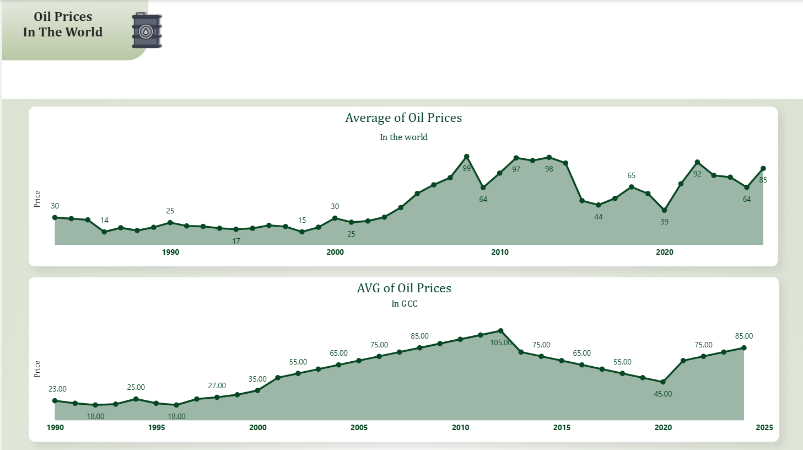
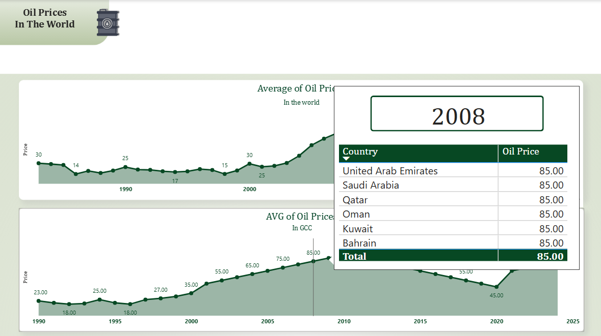
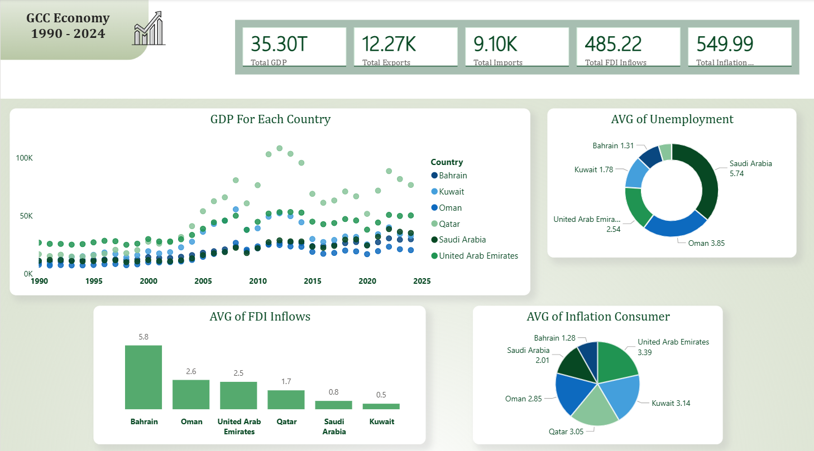
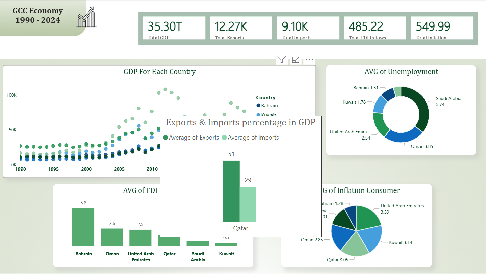
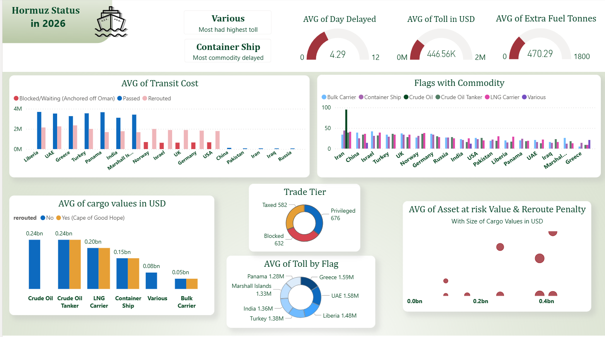
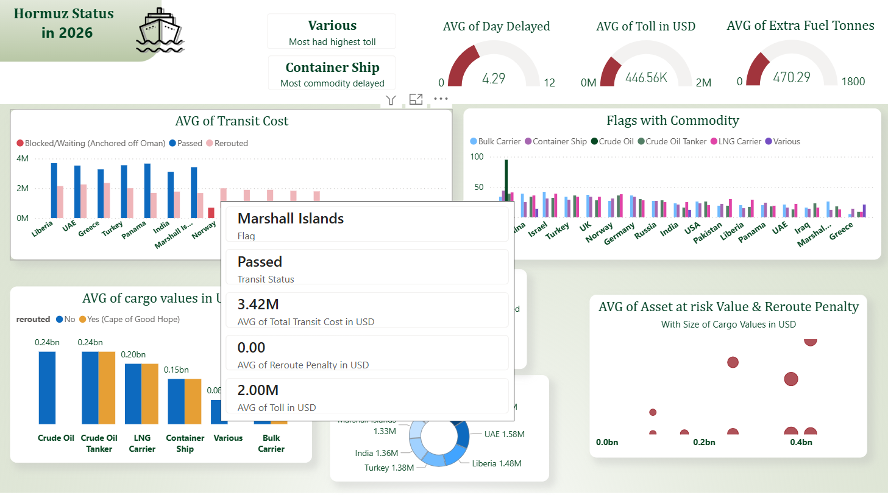

# GCC Economy & Hormuz Status Dashboard

 
Dashboard from 3 pages and different chart that inspired from the issue of Hormuz Strait in Early of 2026 for discover the impact of the issue, the commodity and countries that  
affected becuase it.
 
Also discovering if oil prices will affected by this isseu and if have similar situations in history.  
Finally discover about the Economy of GCC and find relationships between it & the current issue.

  

---

# Photos from dashboard:
 

- Page (1):
 

 

  

- Page (2):

 

 

  

- Page (3):
  
 

 

  

---

 

# Tools Used:

 

- **Kaggel** - Get dataset.
- **Googel Colab** - Clean datasets & quick EDA.
- **Power BI** - Create the dashboard.

